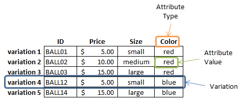

Product Variations
==================

With the SilverShop module it is possible to sell variants of the same product. Doing so keeps your store looking tidy when users browse the site. Here we explain how you can manage these variations.

A product can have an unlimited number of variations. Each variation has a individual price and product id associated with it.

A few terms to understand: _Variation, Attribute Type, Attribute Value._
This table for a "Ball" product explains the terminology visually:

Each variation also has one or more attribute values of a specific type.
The ball example above has a variation with the attribute value 'small' for the attribute type 'size'.

Creating Attribute Types and Values
-----------------------------------

Before you create a product variation, you should first create some attribute types, with values to choose from.

 1. Create Attributes
 
  * In the CMS, navigate to "Catalog" and open the "Attribute" Tab
  * Click the "Add Attribute" Button to add a new Attribute.
  * Give the new attribute type a name (eg: "Shoe Size") and label (eg: "Size"). The 'label' is used on the front-end of the website.
  * Click "Create" (or "Save" if it's an existing Attribute)
 
 2. Add Attribute Values
 
  * Open the Attribute you want to edit in the "Catalog" > "Attribute" Tab
  * Click the "Add Value" Button to add a new Attribute Value
  * Enter the Value (eg. "XL")
  * Click "Create" (or "Save" if it's an existing Value)

 
Creating a Product Variation
----------------------------

Once you have set up some attribute types and values, you can create variations for Products. Firstly, navigate to the Product you want to add Variations to, either via "Pages" or "Catalog"

1. Select the Attributes that will be part of the Variations

 * Find the "Variations" tab for the product.
 * Add all the Attributes that will be part of the Variations in the "Attributes" select field.
 * Save the Product

2. Add Variations
 
 * Click the "Add Variation" Button
 * Fill out a product code, and price.
 * Select the attribute values from the attribute type drop-downs.
 * Click "Create" (or "Save" if it's an existing Variation)
 
 
Creating and updating variations from a spreadsheet
---------------------------------------------------

See [Bulk Loading Products](BulkLoadingProducts#ProductVariations.md).